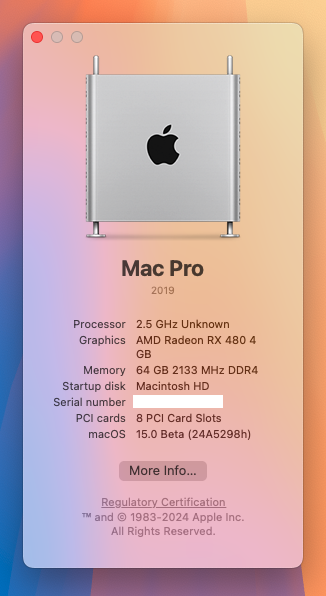

# An OpenCore (0.9.7) EFI that enables a MSI Pro B760M-P based PC to run macOS Sonoma

**Machine's specs:**
- Motherboard details: MSI PRO B760M-P DDR4 ProSeries Motherboard
- CPU details: Intel Core i5-12400 Desktop Processor 18M Cache, up to 4.40 GHz (Alder Lake)
- GPU details: XFX Radeon RX 480 4GB GDDR5 True OC 1266MHz
- WiFi and Bluetooth: BCM94360CS2

**Works with:**
- Sonoma 14.2.1

**User's to do:** 
1. Download **OpenCore Legacy Patcher**
2. Create mac OS istaller for macOS **Sonoma** to a drive
3. Build and install OpenCore to the same drive
4. Mount the drives **EFI** partition of your instal drive and delete it entirely
5. Download this project's latest **release** and unzip the archive, this will give you a single folder named **EFI**
6. Copy the  **EFI** to the root of your instal drive **EFI partition**
7. Download **OpenCore Configurator** and open **config.plist** from your EFI folder
8. Under **PlattformInfo**, select the DataHub - Generic - PlattformNVRAM. Select **MacPro7,1**
9. Save **config.plist**
10. Download the RadeonGadget.app from this [repository](https://github.com/ChefKissInc/RadeonSensor) and add it as a login item to show GPU temp on the menu bar
11. After the installation, move the install drive's EFI to your main drive EFI partition
    
**Credits**
- [OpenCore](https://github.com/acidanthera/OpenCorePkg)
- [Acidanthera](https://github.com/acidanthera)
- [OpenCore Legacy Parcher](https://dortania.github.io/OpenCore-Legacy-Patcher/)

**System Info**

**Geekbench Results**

