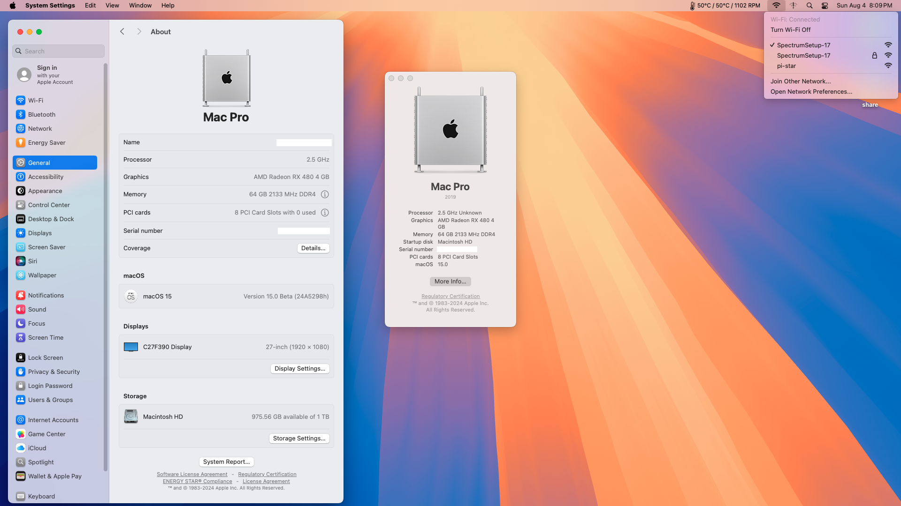

# macOS 15 Sequoia beta on B760M-P using OpenCore

**Machine's specs:**
- Motherboard details: [MSI PRO B760M-P DDR4 ProSeries Motherboard](https://www.amazon.com/MSI-PRO-B760M-P-DDR4-Motherboard/dp/B0BZ9T4KF6/ref=sr_1_1?crid=1C6RYKHS40TNJ&dib=eyJ2IjoiMSJ9.GhpKEwRFuTxcd-ltq56A7PBuBE8dxERMbwMMEbq6L-KOlXdrpTzWQDJO-PFB_oMMrteNJIicmYqUhpW7kA2-P-4BubzRkn4q95FE4PeziP15ZCSR7rXZj6dL0OGmN601pWONi-vuWLQfIC4DsLhSm94M5JfJuW2bwNJJklV3HeYEzlo_otFcaNgqRm_9rzRMCkcqWX2d2kPoP5VJV7_W_rmCWwJuW9Nch1hPWltpDo7KaLqfb9Qrln4ROCiUoJP1StiX4Mg611cRjRv90uue_cRziR42ODglOqtku1uzUKI.dlYZnt-JTAtltBvXbLdxzgpPeD6_EOVsKVXIz-9aH1Q&dib_tag=se&keywords=MSI+PRO+B760M-P&qid=1722815456&s=electronics&sprefix=msi+pro+b760m-p%2Celectronics%2C142&sr=1-1)
- CPU details: [Intel Core i5-12400 Desktop Processor 18M Cache, up to 4.40 GHz (Alder Lake)](https://www.amazon.com/Intel-i5-12400-Desktop-Processor-Cache/dp/B09NMPD8V2/ref=sr_1_1?crid=33W8JT9EFM9QO&dib=eyJ2IjoiMSJ9.py06pC1QXlJgNeou-nfrzKqs5QXG1J04uWyEoO91ysqDMDgyqG2jc16vLLHAuNznPzRcBVcOzODnQB5JRIeWx6vAzNo-uu7wTcb730Br75VxlImuuSk5CrFbnudQcLW_5AXxzU7O3IrHKDppUNgkyzMCWtvZQ67h6KF0v1obV7fSv_2tX-byIkZCE2fjTMuXeIk9o3SDfN6bkYW-znL6S9tm_bEovDsCcbvkA4bW8wAW3OdLj9cCKxFc2mZRocHAG6B8cz98AMPmVuf1lwB_OB6lufVAtECyUFmuuAKcGMQ.qnM1nIWplxWaSgDyBaEfPUmK9O6U5JqY9nnp49D4V9I&dib_tag=se&keywords=Intel+Core+i5-12400&qid=1722815505&s=electronics&sprefix=intel+core+i5-12400%2Celectronics%2C138&sr=1-1)
- HD details: [M.2 SSD Internal Solid State Drive 1TB](https://www.amazon.com/gp/product/B0B985RSS1/ref=ppx_yo_dt_b_search_asin_title?ie=UTF8&psc=1)
- GPU details: [XFX Radeon RX 480 4GB GDDR5 True OC 1266MHz](https://www.amazon.com/gp/product/B01KAA0L6M/ref=ppx_yo_dt_b_search_asin_title?ie=UTF8&psc=1)
- WiFi and Bluetooth: [Intel WiFi 6E AX210](https://www.amazon.com/gp/product/B08NJ4HTL3/ref=ppx_yo_dt_b_asin_title_o01_s00?ie=UTF8&th=1)

**Works with:**
- Sequoia 15.0 Beta (24A5298h)

**User's to do:** 
1. Download Sequioia - [macOS 15.0 Beta (24A5298h)](https://swcdn.apple.com/content/downloads/48/45/062-39268-A_36NTYE5BPL/0cd85jhjwcbnmk5fqvu4yp323wcmzr9jmu/InstallAssistant.pkg)
2. Download **OpenCore Legacy Patcher**
3. Create mac OS istaller for macOS **Sequoia** to a drive
4. Build and install OpenCore to the same drive
5. Mount the drives **EFI** partition of your instal drive and delete it entirely
6. Download this project's latest **release** and unzip the archive, this will give you a single folder named **EFI**
7. Copy the  **EFI** to the root of your instal drive **EFI partition**
8. Download **OpenCore Configurator** and open **config.plist** from your EFI folder
9. Under **PlattformInfo**, select the DataHub - Generic - PlattformNVRAM. Select **MacPro7,1**
10. Save **config.plist**
11. Download the HeliPort.app from this [repository](https://github.com/OpenIntelWireless/HeliPort) and add it as a login item to show WiFi options on the menu bar
13. Download the RadeonGadget.app from this [repository](https://github.com/ChefKissInc/RadeonSensor) and add it as a login item to show GPU temp on the menu bar
14. After the installation, move the install drive's EFI folder to your main startup drive EFI partition
    
**Credits**
- [OpenIntelWireless](https://github.com/OpenIntelWireless)
- [perez987](https://github.com/perez987/Intel-AX210-wifi6-on-macOS-Sonoma)
- [OpenCore](https://github.com/acidanthera/OpenCorePkg)
- [Acidanthera](https://github.com/acidanthera)
- [OpenCore Legacy Parcher](https://dortania.github.io/OpenCore-Legacy-Patcher/)
- [Mr. Macintosh](https://mrmacintosh.com/)

**System Info**

